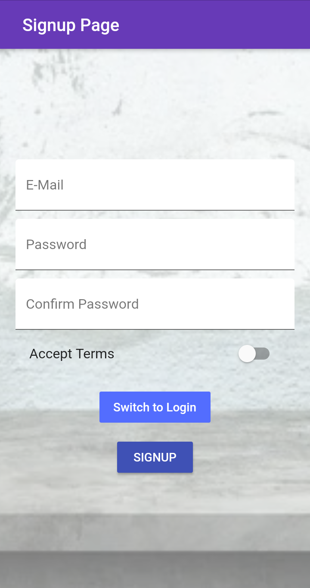
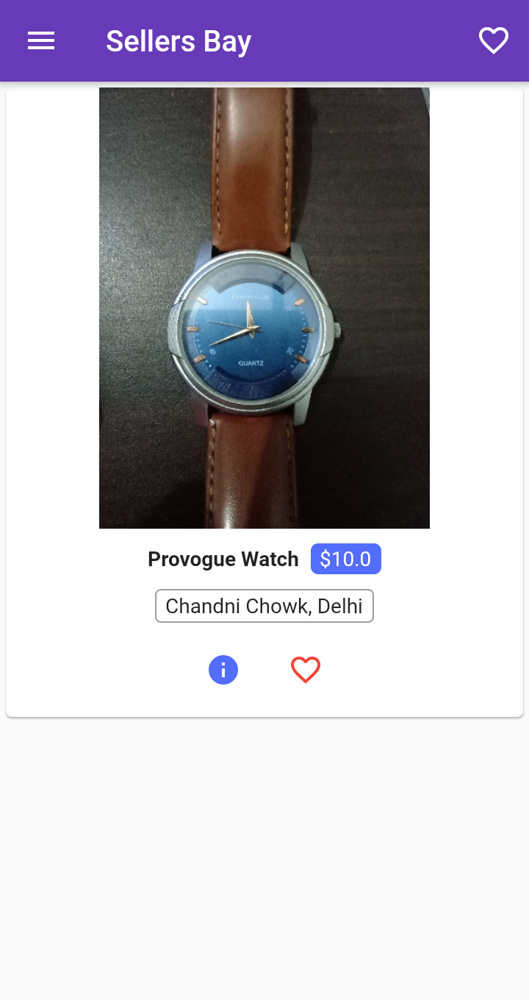
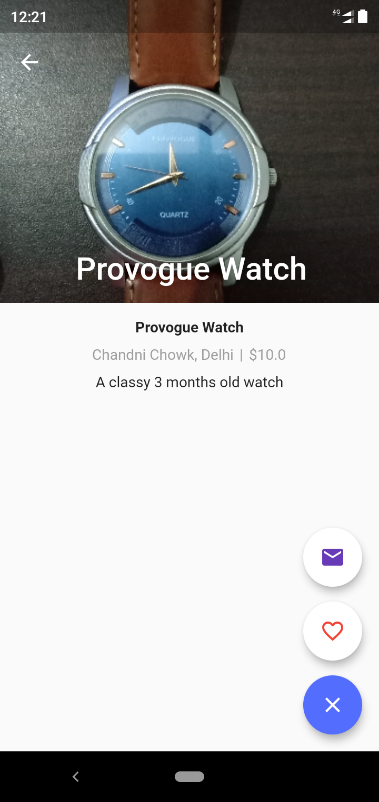
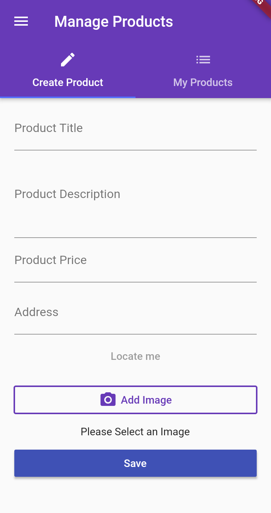
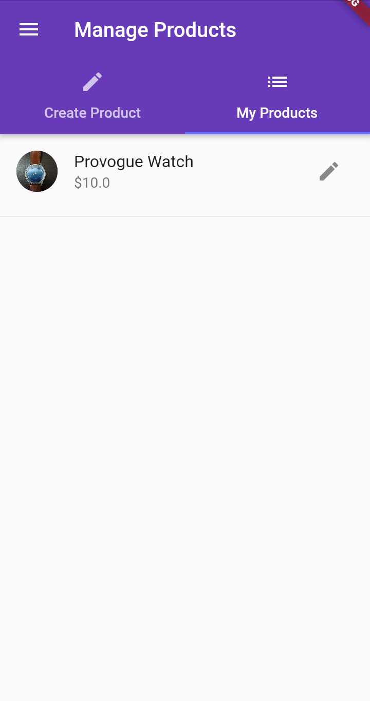

# Sellers Bay

A mobile application made in flutter with firebase realtime database as backend.

Also cloud functions are used - 
 * To upload an image to the cloud
 * To delete an image automatically from the cloud

A platform where people can sell their products.

It takes the following input from the user to add a new product- 
 * Product Name
 * Product Description
 * Product Price
 * Loaction (Entered manually or extracted from GPS )
 * Product Image (From Gallery or from Camera)

 The User Email is automatically attached to product description which is taken during authentication.

 Screeenshots of App - 
 
 {:height="50%" width="50%"}
 {:height="50%" width="50%"}
 {:height="50%" width="50%"}
 {:height="50%" width="50%"}
 {:height="50%" width="50%"}

 

